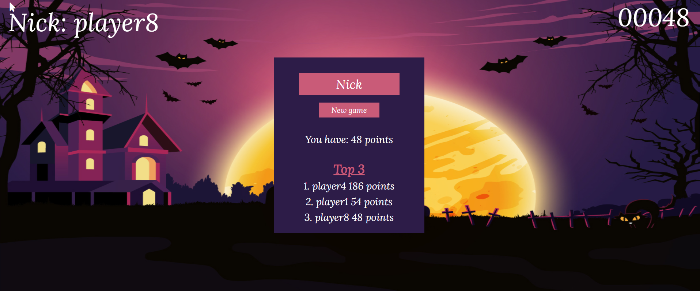
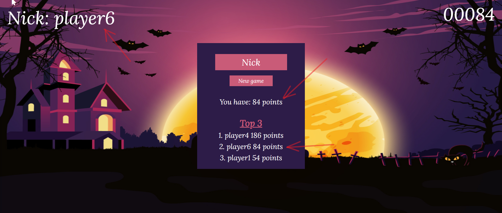

# Zombie_game
Simple zombie game created for Intruduction to Web Applications course (WDAI) at AGH 2021/22

### Technologies used:
* HTML
* CSS
* JavaScript

### Game rules
The game is about shooting zombies. Each killed zombie scores 12 points, but a missed shot takes 6 points. The game is over when 3 zombies reach the left side of the screen. Zombies appear in random places, with random frequency and random movement speed.

### High score 
To start the game, you must enter your nickname. 
The top three results appear in the ranking. If your result is better than the third one, it will be saved in the ranking on the server.  

Before game

After game - new score appears in the ranking

